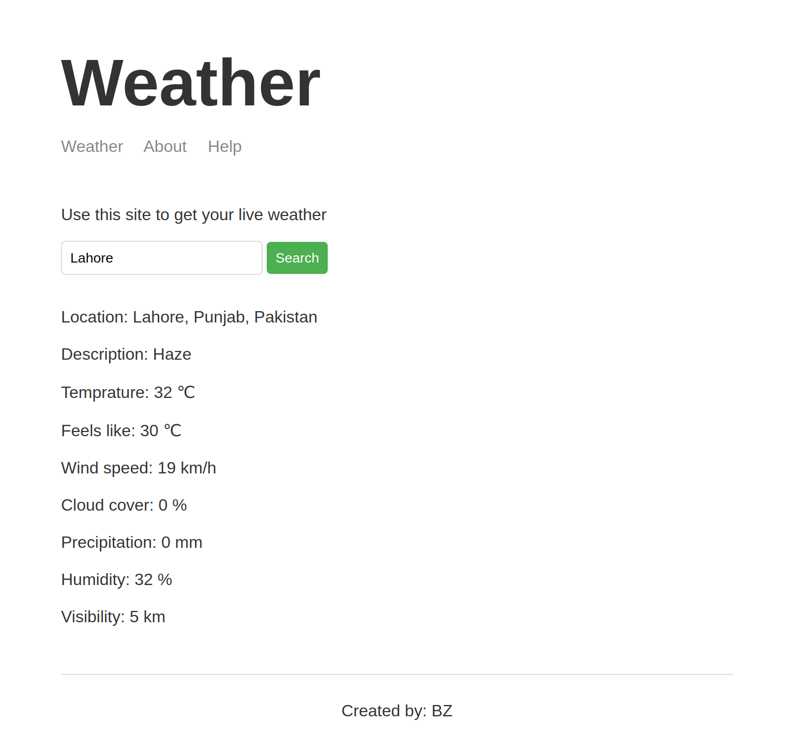

# Weather Application Using Node.js
This is a simple weather application using Node.js and Express.js. It uses the WeatherStack API to get the weather data. It also uses Mapbox API to get the location data.

## Features
* User can search for weather of any location
* User can see the weather of his/her current location

## See the live demo
<a href="https://bilal-weather-application-node.herokuapp.com/"> Click To View</a>

## Download & Setup Instructions

* 1 - Clone project:

      git clone https://github.com/bilal-zafarr/weather-website-node.git
        
* 2 - Go to project directory:

      cd ./weather-website-node

* 3 - Install dependencies: 
        
      npm install
        
* 4 - Run project: 

      npm start
        
* 5 - Open project in browser:

      http://localhost:3000

## Screenshot
#### Home Page

